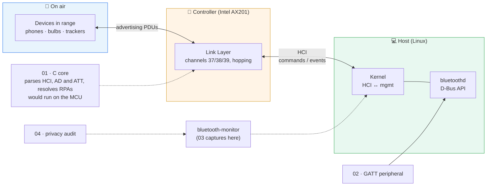

# BLE Lab

*[中文](README.zh-CN.md)*

> ### [&#9654; Open the visual walkthrough](https://yihao23.github.io/ble-lab/)
> One page, air to application: what runs at every hop, with the real
> captures and logs behind each claim — and the pairing whose six digits
> this repository's code computes.

Bluetooth Low Energy from the bottom up, as an embedded developer meets it: the
bytes a controller hands the host, the C that parses them on a microcontroller,
a GATT server that makes decisions a phone depends on, and a privacy audit of
forty minutes of real traffic.

> **Every claim is backed by something that ran.** A 40-minute HCI capture of
> a real environment, a C library checked against Wireshark on all 59 437
> advertising reports in it, a peripheral whose advertisement was verified in
> the HCI log — and the three things that log proved wrong about it.

---

## The system in one picture



**The one thing to understand first:** HCI is the line between the part of
Bluetooth you write and the part you buy. Everything above it — parsing,
privacy, GATT, pairing policy — is host software, and on a single-chip device
it is *your* firmware. Everything below it — channels, timing, the radio — is
the controller, and the host never sees it: an advertising report does not
even say which channel it came in on.

**The question every interview asks:**
*"Your device rotates its address. Is it private?"*

```
address:   a ──► b ──► c ──► d          rotates every ~8 min
payload:   u ──────────► v ───────►     rotates every 10–20 min, on its own clock
                ↑           ↑
          each rotation is bridged by the field that did not change
```

Project **04** found exactly this, on air, in devices around a laptop.

---

## The four projects

| # | Project | What it proves | Status |
|---|---|---|---|
| **01** | [BLE core in C](01-ble-core-c/) | You can write the parser that runs on the microcontroller: no heap, no libc, every length checked | ✅ 2060 checks, ASan+UBSan fuzz, 0 mismatches vs Wireshark on 59 437 advertising reports and 1 410 ACL packets of real phone sessions, 3.9 KB flash and 496 B worst-case stack on Cortex-M0+ |
| **02** | [GATT peripheral on BlueZ](02-gatt-peripheral/) | You can design a GATT server: formats, error codes, notification policy, security levels | ✅ 25 tests; a real phone reads, subscribes, writes and pairs — HCI-verified |
| **03** | [Reading HCI](03-hci-capture/) | You can read the host–controller boundary, where field bugs are decided | ✅ 40-min capture, 6-section report |
| **04** | [Advertising privacy audit](04-adv-privacy/) | You can turn a capture into findings someone can act on | ✅ 41 tests, 10 rules, pseudonymised reports |

Each project's README has its own quick start, gotchas table and interview
talking points.

---

## What the four projects found

**Address rotation defeated by the payload.** Devices advertising Google
service data changed their address every few minutes but kept the same
20-plus-byte payload for 10–20 minutes. 9 of 13 address changes carried the payload over
unchanged, 0.1–3.1 s later. The same devices ran two advertising sets at once
under two addresses, the extended payload starting with the legacy one. One
device: 7 addresses, one 40-minute trace. [Project 04](04-adv-privacy/).

**Three ways to track a light bulb.** A public address, a name ending in two
bytes of that address, and the LE *Limited* Discoverable flag held for 40
minutes where the spec allows 180 s — from a company ID that is not in the
Bluetooth SIG's assigned numbers.

**The HCI log contradicted the D-Bus documentation three times.** The
peripheral in project 02 advertised with no Flags AD at all, put its name in
the scan response, and used the laptop's public address. The first is fixed
and verified; the third is finding P001 of project 04, about my own device.
[Project 02](02-gatt-peripheral/).

**All tests passed; the first phone to connect could not read a thing.**
Every read came back ATT `0x0E`: a helper method named `_name` was silently
overwritten by an attribute of the same name that the D-Bus base class sets
in its constructor. Nothing had run that layer until a real client did. And
the `0xFF` Out of Range the device chooses reaches the phone as `0x80`:
BlueZ 5.72 cannot send `0xE0`–`0xFF` from a D-Bus application at all.
[Project 02](02-gatt-peripheral/).

**The pairing arithmetic, checked on a real pairing.** A phone paired with
this laptop by numeric comparison, and both screens showed 985572. Taking
the two public keys and the two nonces off the HCI capture — after
recomputing the laptop's commitment to prove they were read correctly —
project 01's `ble_sc_g2` computes 985572. The code was written against the
spec's test vector; the phone confirmed it.
[Project 02](02-gatt-peripheral/) · [Project 01](01-ble-core-c/).

**The scanner rotates too.** bluetoothd's active scan restarts every 10.75 s
with a fresh non-resolvable address — 224 in 40 minutes, all distinct —
because every `SCAN_REQ` carries the scanner's address.
[Report §2](03-hci-capture/report/REPORT-01.md).

**RSSI is not distance, even when nobody is lying.** A bulb that never moved
spans 8 dB between the 5th and 95th percentile of its RSSI — a factor of 2.5 in
distance. [Report §4](03-hci-capture/report/REPORT-01.md).

**A false positive, found on real data.** The first analyser linked three
Apple devices on a 17-byte payload that was a near-all-zero bitmap. It is a
regression test now.

---

## Course map / 与课程的对应

Built alongside *Foundations of Wireless Security* (Saarland University,
summer 2026). What each lecture became, and what it did not:

| Lecture | Topic | In this repo |
|---|---|---|
| L1 | Wireless basics, link budget | dBm and path loss: turning an 8 dB RSSI spread into a distance error (03 §4) |
| L2 | Wireless authentication, RSSI and phase ranging | RSSI of stationary devices over 40 min (03 §4) |
| L3–L4 | Distance bounding at the physical layer | — discussed in 03 §4 as the reason RSSI proximity fails; no code here |
| L5–L6 | Positioning, GPS spoofing | — see the separate [gps-security-lab](../gps-security-lab/) |
| L7 | Jamming, FHSS | Advertising-channel hopping is below HCI and invisible to the host (03 §3) |
| L8 | Authentication and confidentiality | IRK and `ah()`, AES-CMAC and the numeric-comparison value `g2` (01); a real numeric-comparison pairing and the authenticated write it unlocks (02) |
| L9 | WiFi | — not covered |
| L10 | Location privacy, identifier rotation, CrossLink | All of project 04 |

---

## 60-second demo

```bash
# 1. the C library: build, test, fuzz under sanitizers
cd 01-ble-core-c
cmake -S . -B build-asan -G Ninja -DBLE_SANITIZE=ON && cmake --build build-asan
./build-asan/ble_tests                      # 2060 checks, 0 failed

# 2. five minutes of the air around you, read layer by layer
cd ../03-hci-capture
./capture.sh 5                              # needs the wireshark group

# 3. who in range is trackable
cd ../04-adv-privacy
python3 -m bleprivacy ../03-hci-capture/captures/scan-*.pcapng
```

Everything runs on a Linux laptop with its built-in Bluetooth. No dev board,
no sniffer, no phone — those are what the TODOs are for.

---

## Documentation

| Doc | What |
|---|---|
| [`03-hci-capture/report/REPORT-01.md`](03-hci-capture/report/REPORT-01.md) | Forty minutes of HCI, six sections, every number reproducible |
| [`04-adv-privacy/samples/`](04-adv-privacy/samples/) | The privacy report on that capture, Markdown and JSON, pseudonymised |
| [`docs/GLOSSARY.md`](docs/GLOSSARY.md) | Every acronym in this repo |
| [`docs/14-DAY-PLAN.md`](docs/14-DAY-PLAN.md) | The plan this was built to, with what is still open |

---

## Privacy

A capture of the air is a list of your neighbours' devices, so `captures/`
directories are git-ignored. What is published: seven C test fixtures with
addresses and payloads scrubbed, and reports in which every address is a keyed
hash with a key that was never written down. `grep` for a MAC address in this
repository finds none.

---

## Tests

```bash
cd 01-ble-core-c    && cmake -S . -B build -G Ninja && cmake --build build && ./build/ble_tests   # 2060 checks
cd 02-gatt-peripheral && python3 -m unittest discover -s tests -t .                                # 25 tests
cd 04-adv-privacy     && python3 -m unittest discover -s tests -t .                                # 41 tests
```

Projects 02 and 04 are standard-library Python plus the system's
`python3-dbus`: they run on an embedded Linux gateway as they are.

`03` has no tests — it is a reading project, and its output is the report.

---

## Open source used

| Project | Role here |
|---|---|
| [BlueZ](https://github.com/bluez/bluez) | The Linux Bluetooth host: bluetoothd, its D-Bus API — projects 02, 03 |
| [Wireshark / tshark](https://gitlab.com/wireshark/wireshark) | Capture (`dumpcap`) and the reference decoder every parser here is checked against |
| [Arm GNU Toolchain](https://developer.arm.com/Tools%20and%20Software/GNU%20Toolchain) | `arm-none-eabi-gcc` for the Cortex-M size and stack figures — project 01 |
| [pyca/cryptography](https://github.com/pyca/cryptography) | Cross-check for the pure-Python AES — project 04 tests |
| [Zephyr](https://github.com/zephyrproject-rtos/zephyr) | Where `model.py` of project 02 would go on a real MCU |
| [nRF Connect for Mobile](https://www.nordicsemi.com/Products/Development-tools/nRF-Connect-for-mobile) | The phone side of project 02's TODOs |
