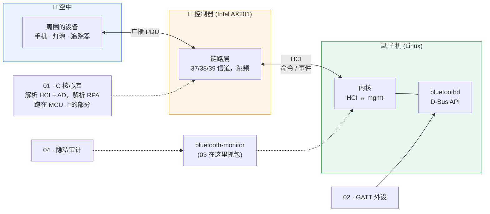

# BLE 实验室

*[English](README.md)*

从底层往上学 Bluetooth Low Energy，按嵌入式开发者遇到它的顺序：控制器交给主机的字节、
在单片机上解析它们的 C 代码、一个手机要依赖其决策的 GATT 服务器，以及对四十分钟真实流量
的隐私审计。

> **每一个结论背后都有真正跑过的东西。** 一份真实环境的 40 分钟 HCI 抓包；一个在其中
> 全部 59 437 个广播报告上与 Wireshark 逐字段对拍的 C 库；一个广播内容经 HCI 日志验证的
> 外设——以及那份日志证明它错了的三件事。

---

## 一张图看懂整个系统



**首先要理解的一件事：** HCI 是蓝牙里"你写的部分"和"你买的部分"之间的分界线。
它之上的一切——解析、隐私、GATT、配对策略——都是 host 软件，在单芯片设备上就是*你的*固件。
它之下的一切——信道、时序、射频——属于控制器，主机永远看不到：广播报告甚至不告诉你它来自哪个信道。

**每场面试都会问的问题：**
*"你的设备会轮换地址。它就隐私了吗？"*

```
地址:     a ──► b ──► c ──► d          约每 8 分钟轮换
payload:  u ──────────► v ───────►     每 10–20 分钟轮换，用的是自己的时钟
               ↑           ↑
          每次轮换都被没变的那个字段桥接起来
```

项目 **04** 在笔记本周围的真实设备上、在空中抓到了一模一样的现象。

---

## 四个项目

| # | 项目 | 证明了什么 | 状态 |
|---|---|---|---|
| **01** | [C 语言 BLE 核心库](01-ble-core-c/) | 能写跑在单片机上的解析器：不用堆、不依赖 libc、每个长度都检查 | ✅ 182 项检查、ASan+UBSan fuzz、59 437 个报告与 Wireshark 0 差异、Cortex-M0+ 上 1.7 KB |
| **02** | [基于 BlueZ 的 GATT 外设](02-gatt-peripheral/) | 能设计 GATT 服务器：数据格式、错误码、notification 策略、安全等级 | ✅ 24 个测试，已注册并广播，经 HCI 验证 |
| **03** | [读懂 HCI](03-hci-capture/) | 能读懂主机-控制器边界，现场 bug 在这里定性 | ✅ 40 分钟抓包，6 节报告 |
| **04** | [广播隐私审计](04-adv-privacy/) | 能把抓包变成别人可以据此行动的结论 | ✅ 41 个测试、10 条规则、脱敏报告 |

每个项目的 README 都有自己的快速开始、踩坑表和面试要点。

---

## 四个项目发现了什么

**payload 让地址轮换失效。** 广播 Google service data 的设备每几分钟换一次地址，
但 20 多字节的 payload 保持 10–20 分钟不变。13 次地址变化中有 9 次在 0.1–3.1 秒后
把 payload 原样带了过去。同一批设备还同时用两个地址跑两个广播集，extended payload
的开头就是 legacy payload。一个设备：7 个地址，一条 40 分钟的轨迹。[项目 04](04-adv-privacy/)。

**追踪一个灯泡的三种方法。** public 地址、名字结尾是该地址的两个字节、LE *Limited*
Discoverable 标志持续 40 分钟（规范上限 180 秒）——而且 company ID 不在蓝牙 SIG 的分配列表里。

**HCI 日志三次推翻了 D-Bus 文档。** 项目 02 的外设广播里完全没有 Flags、名字在 scan
response 里、用的是笔记本的 public 地址。第一条已修复并验证；第三条正是项目 04 的 P001，
对象是我自己的设备。[项目 02](02-gatt-peripheral/)。

**扫描器自己也在轮换。** bluetoothd 的主动扫描每 10.75 秒重启一次并换一个新的不可解析
地址——40 分钟 224 个，互不相同——因为每个 `SCAN_REQ` 都带着扫描者地址。
[报告 §2](03-hci-capture/report/REPORT-01.md)。

**即使没人撒谎，RSSI 也不是距离。** 一个从没动过的灯泡，RSSI 的 5%–95% 区间跨 8 dB
——换算成距离是 2.5 倍误差。[报告 §4](03-hci-capture/report/REPORT-01.md)。

**真实数据发现的误报。** 第一版分析器因为一个几乎全零的 17 字节 bitmap 把三台 Apple
设备连成了一台。现在它是一个回归测试。

---

## 与课程的对应

配合 *Foundations of Wireless Security*（萨尔大学，2026 夏季学期）完成。每一讲变成了什么，没变成什么：

| 讲 | 主题 | 在本仓库中 |
|---|---|---|
| L1 | 无线基础、链路预算 | dBm 与路径损耗：把 8 dB 的 RSSI 波动换算成距离误差（03 §4） |
| L2 | 无线认证、RSSI 与相位测距 | 静止设备 40 分钟的 RSSI（03 §4） |
| L3–L4 | 物理层距离界定 | —— 在 03 §4 中作为 RSSI 近距判断失败的原因讨论；这里没有代码 |
| L5–L6 | 定位、GPS 欺骗 | —— 见单独的 [gps-security-lab](../gps-security-lab/) |
| L7 | 干扰、跳频 | 广播信道跳频发生在 HCI 之下，主机看不到（03 §3） |
| L8 | 认证与机密性 | IRK 与 `ah()`（01）；需加密认证的 GATT 写（02，配对仍是 TODO） |
| L9 | WiFi | —— 未涉及 |
| L10 | 位置隐私、标识符轮换、CrossLink | 整个项目 04 |

---

## 60 秒演示

```bash
# 1. C 库：编译、测试、在 sanitizer 下 fuzz
cd 01-ble-core-c
cmake -S . -B build-asan -G Ninja -DBLE_SANITIZE=ON && cmake --build build-asan
./build-asan/ble_tests                      # 182 checks, 0 failed

# 2. 抓你周围 5 分钟的空中流量，逐层读
cd ../03-hci-capture
./capture.sh 5                              # 需要 wireshark 用户组

# 3. 周围谁是可追踪的
cd ../04-adv-privacy
python3 -m bleprivacy ../03-hci-capture/captures/scan-*.pcapng
```

一台 Linux 笔记本加上自带的蓝牙就能全部跑起来。不需要开发板、不需要 sniffer、不需要手机——
那些是 TODO 要做的事。

---

## 文档

| 文档 | 内容 |
|---|---|
| [`03-hci-capture/report/REPORT-01.md`](03-hci-capture/report/REPORT-01.md) | 四十分钟的 HCI，六节，每个数字都可复现 |
| [`04-adv-privacy/samples/`](04-adv-privacy/samples/) | 该抓包的隐私报告，Markdown 和 JSON，已脱敏 |
| [`docs/GLOSSARY.md`](docs/GLOSSARY.md) | 本仓库出现的所有缩写 |
| [`docs/14-DAY-PLAN.md`](docs/14-DAY-PLAN.md) | 按它构建的计划，以及还没完成的部分 |

---

## 隐私

空中抓包就是一份邻居设备清单，所以所有 `captures/` 目录都被 git 忽略。公开的内容只有：
地址和 payload 已擦除的 7 个 C 测试 fixture，以及地址全部替换为带密钥哈希的报告——
那个密钥从未被写下来。在本仓库里 `grep` MAC 地址，一个也找不到。

---

## 测试

```bash
cd 01-ble-core-c    && cmake -S . -B build -G Ninja && cmake --build build && ./build/ble_tests   # 182 checks
cd 02-gatt-peripheral && python3 -m unittest discover -s tests -t .                                # 24 tests
cd 04-adv-privacy     && python3 -m unittest discover -s tests -t .                                # 41 tests
```

项目 02 和 04 只用标准库 Python 加系统自带的 `python3-dbus`：可以原样跑在嵌入式 Linux 网关上。

`03` 没有测试——它是一个阅读项目，产出就是报告。

---

## 用到的开源项目

| 项目 | 在这里的角色 |
|---|---|
| [BlueZ](https://github.com/bluez/bluez) | Linux 蓝牙主机栈：bluetoothd 及其 D-Bus API —— 项目 02、03 |
| [Wireshark / tshark](https://gitlab.com/wireshark/wireshark) | 抓包（`dumpcap`），以及所有解析器对拍用的参考解码器 |
| [Arm GNU Toolchain](https://developer.arm.com/Tools%20and%20Software/GNU%20Toolchain) | `arm-none-eabi-gcc`，用于 Cortex-M 尺寸和栈数据 —— 项目 01 |
| [pyca/cryptography](https://github.com/pyca/cryptography) | 纯 Python AES 的交叉验证 —— 项目 04 测试 |
| [Zephyr](https://github.com/zephyrproject-rtos/zephyr) | 项目 02 的 `model.py` 在真实 MCU 上的去处 |
| [nRF Connect for Mobile](https://www.nordicsemi.com/Products/Development-tools/nRF-Connect-for-mobile) | 项目 02 TODO 中的手机端 |
